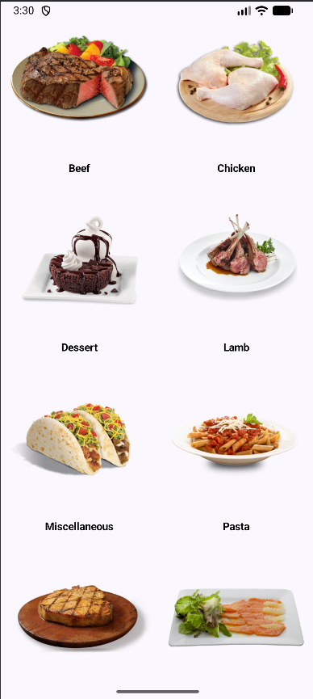

# Meal Categories App 🍽️

A simple Jetpack Compose app built while following a Udemy course.  
It uses **TheMealDB API** to fetch and display meal categories.

---

## 📸 Preview

  

---

## 🚀 Tech Stack

- Kotlin
- Jetpack Compose
- Retrofit
- Coil
- TheMealDB API

---

## ✨ Features

- Fetches meal categories from the API
- Displays categories with images
- Simple, clean UI built with Compose

---

## 🔗 API

Data provided by **TheMealDB**:  
https://www.themealdb.com/api.php

Used endpoint:  
https://www.themealdb.com/api/json/v1/1/categories.php